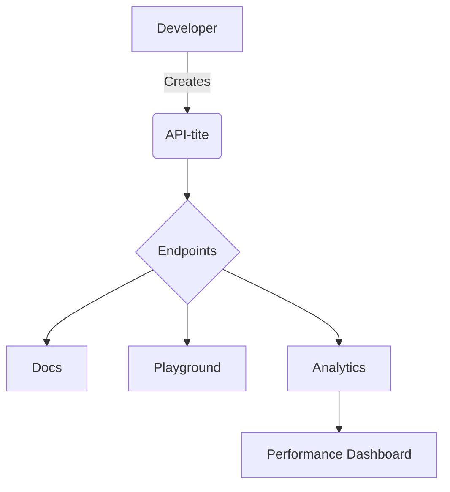

# API-tite
An AI-powered food discovery app that recommends specific dishes based on your unique taste profile, built with Python, Flask, and NLTK.

# 🚀 API-tite

Welcome to **API-tite** – your all-in-one toolkit for effortless API development, testing, and documentation!  
Whether you're a backend wizard or just starting your API journey, API-tite streamlines every step.

---

## 🎬 Animated Overview


---

## 🧩 Features

- **Plug & Play API Endpoints**
- **Auto-generated Docs**
- **Live Testing Playground**
- **Secure Authentication**  
- **Performance Analytics**

---

## 🛠️ Technologies


---

## 🖼️ Infographics

### **How It Works**



---

## 🚦 Quick Start

```bash
git clone https://github.com/SairajChowdhary/API-tite.git
cd API-tite
docker-compose up --build
```
Your API is live at `http://localhost:8000`!

---

## 🤝 Contributing

We love contributors!  
Check out [`CONTRIBUTING.md`](CONTRIBUTING.md) for how to get started.

---

## 📬 Contact

Questions? Feedback?  
[Open an issue](https://github.com/SairajChowdhary/API-tite/issues) or email [SairajChowdhary](mailto:sairajchowdhary@gmail.com).

---

> _API-tite: The bite-sized API toolkit with a big impact!_

---

I Built this using Flask to serve recommendations and manage data, making the system modular and scalable.
You can do API testing using Postman or simply use curl
So basically you can run this following the below steps:
- git clone https://github.com/your-username/API-tite.git
- cd API-tite
-- pip install -r requirements.txt or pip3 install -r requirements.txt
 # run the Flask application
-- Run 'python3 app.py' in your terminal and then send a POST request to the /setup endpoint using a tool like Postman or curl

you should see this in your terminal:
 * Serving Flask app 'app'
 * Running on http://127.0.0.1:5000
Press CTRL+C to quit
And Leave this terminal window open! This is your running server. If you close it, the next step will fail.
# Terminal 2: Set Up the Database
Open a new terminal and paste this:
curl -X POST http://127.0.0.1:5000/setup
you should see: {"message":"Database setup complete."}
This basically created a new file named 'gourmetgo.db'. That's a SQLite database with sample data.
Happy Coding!
        ~Sairaj Chowdhary
